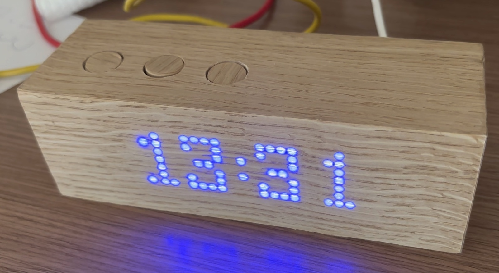

# Arduino wooden clock project

## General

This is a wooden clock project which is capable of beautifully showing time, date or alternating between both. It also has the capability of setting the time and showing a welcome message when turned on.

## Design

Construction and measurements are available in arduino_clock.scad. Open the file with OpenSCAD.

## Requirements:

- Arduino Nano (Arduino micro will also fit)
- Small perfboard for soldering
- MAX2719 4pcs 8x8 led display grids (I purchased 4 connected modules)
- RTC module (e.g. TinyRTC)
- 3pcs 10kOhm resistors
- 3pcs small push buttons
- Some wires

Also, for building the case I used 12mm veneer which I had lying around. SCAD file is for 12mm thickness. I decorated veneer with wooden film, specifically this.

https://www.aliexpress.com/item/1005005327698778.html?spm=a2g0o.order_list.order_list_main.20.3a6b1802T0AMOs

One could use something else. Or maybe spray paint the case - in which case one would need transparent film to be put on led surface for painting. Paint layer needs to be thin enough to pass through the light.

